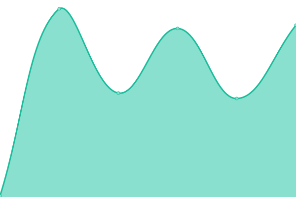
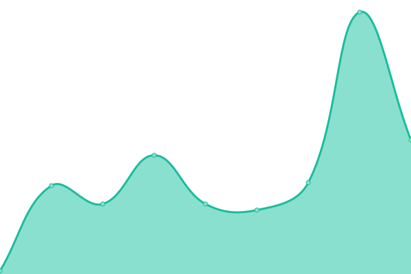

# [📈 Live Status](https://incarnatewill.github.io/uptime): <!--live status--> **🟩 All systems operational**

This repository contains the open-source uptime monitor and status page for [incarnatewill](https://incarnatewill.github.io/uptime), powered by [Upptime](https://github.com/upptime/upptime).

With [Upptime](https://upptime.js.org), you can get your own unlimited and free uptime monitor and status page, powered entirely by a GitHub repository. We use [Issues](https://github.com/incarnatewill/uptime/issues) as incident reports, [Actions](https://github.com/incarnatewill/uptime/actions) as uptime monitors, and [Pages](https://incarnatewill.github.io/uptime) for the status page.

<!--start: status pages-->
<!-- This summary is generated by Upptime (https://github.com/upptime/upptime) -->
<!-- Do not edit this manually, your changes will be overwritten -->
<!-- prettier-ignore -->
| URL | Status | History | Response Time | Uptime |
| --- | ------ | ------- | ------------- | ------ |
|  [Raphtalia](main.raphtalia.fun) | 🟩 Up | [raphtalia.yml](https://github.com/IncarnateWill/uptime/commits/HEAD/history/raphtalia.yml) | 

 156ms
     
 | 

<a href="https://status.raphtalia.fun/history/raphtalia">100.00%</a>
    

|  [Webserver](ws.raphtalia.fun) | 🟩 Up | [webserver.yml](https://github.com/IncarnateWill/uptime/commits/HEAD/history/webserver.yml) | 

 157ms
     
 | 

<a href="https://status.raphtalia.fun/history/webserver">100.00%</a>
    

|  [Ge-1](ge1.raphtalia.fun) | 🟩 Up | [ge-1.yml](https://github.com/IncarnateWill/uptime/commits/HEAD/history/ge-1.yml) | 

 143ms
     
 | 

<a href="https://status.raphtalia.fun/history/ge-1">100.00%</a>
    

|  [Ge-2](ge2.raphtalia.fun) | 🟩 Up | [ge-2.yml](https://github.com/IncarnateWill/uptime/commits/HEAD/history/ge-2.yml) | 

 119ms
     
 | 

<a href="https://status.raphtalia.fun/history/ge-2">100.00%</a>
    

|  [Ge-3](ge3.raphtalia.fun) | 🟩 Up | [ge-3.yml](https://github.com/IncarnateWill/uptime/commits/HEAD/history/ge-3.yml) | 

 0ms
     
 | 

<a href="https://status.raphtalia.fun/history/ge-3">100.00%</a>
    

|  [Us-1](us1.raphtalia.fun) | 🟩 Up | [us-1.yml](https://github.com/IncarnateWill/uptime/commits/HEAD/history/us-1.yml) | 

 40ms
     
 | 

<a href="https://status.raphtalia.fun/history/us-1">100.00%</a>
    

|  [As-1](as1.raphtalia.fun) | 🟩 Up | [as-1.yml](https://github.com/IncarnateWill/uptime/commits/HEAD/history/as-1.yml) | 

 0ms
     
 | 

<a href="https://status.raphtalia.fun/history/as-1">100.00%</a>
    

<!--end: status pages-->

[**Visit our status website →**](https://incarnatewill.github.io/uptime)

## 📄 License

- Powered by: [Upptime](https://github.com/upptime/upptime)
- Code: [MIT](./LICENSE) © [incarnatewill](https://incarnatewill.github.io/uptime)
- Data in the `./history` directory: [Open Database License](https://opendatacommons.org/licenses/odbl/1-0/)
